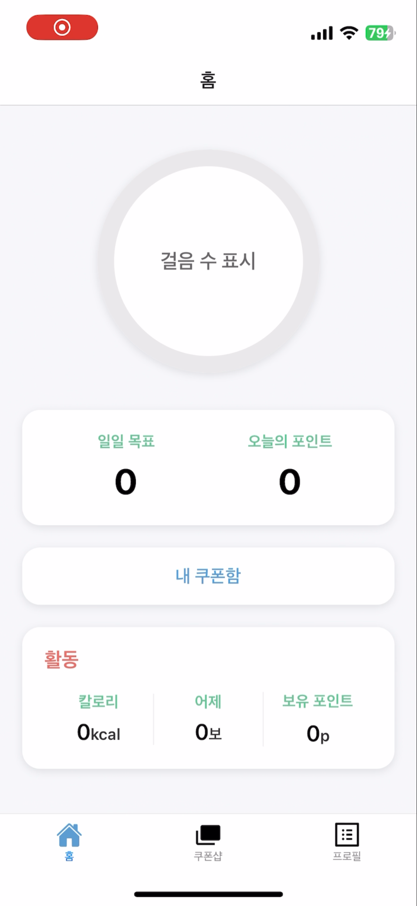
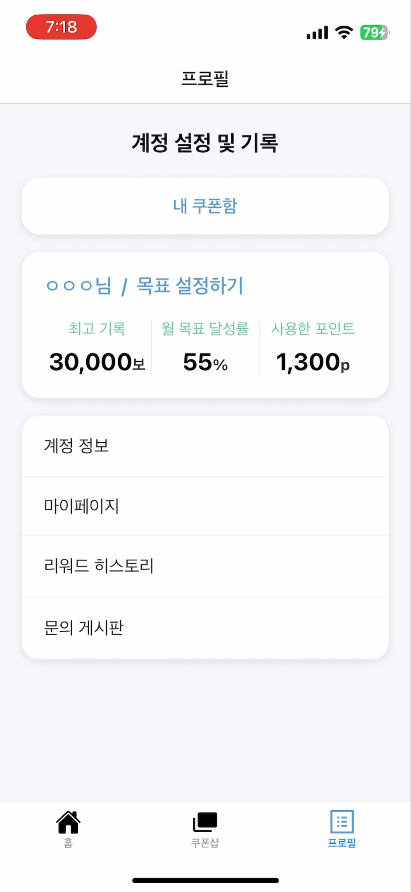

# Dart & Flutter / React Native(expo)

프로젝트를 위한 Flutter & Dart언어 학습을 기록한 공간입니다.

놔마드코더 강의를 수강했습니다.

스택 변경 -> 실전 React Native 활용을 기록한 공간입니다.

## [Dart]

#### [1. Dart 소개](https://devlog111.tistory.com/5) 

#### [2. Dart의 다양한 변수들](https://devlog111.tistory.com/6)

#### [3. Dart의 데이터 타입](https://devlog111.tistory.com/7)

#### [4. Dart의 함수](https://devlog111.tistory.com/8)

#### [5. Dart의 클래스 - 마무리](https://devlog111.tistory.com/9)

## [Flutter]

#### [1. Flutter 설치 및 소개](https://devlog111.tistory.com/11)

## [React Native]

#### [RN개발세팅](https://devlog111.tistory.com/14)

***

# 기술 스택
React Native (expo)

# 실행

vsCode에서 코드를 작성하고 expo go를 활용하여 화면을 구성하였습니다.

# 실행 결과

초기 UI 구성: 중첩 네비게이터를 사용하여 탭 네비게이터와 스택 네비게이터를 동시에 사용했습니다.
             만보기 기능을 구현하기 위해 프로그레스 바를 구현하여 넣었습니다.

 

UI 개선: 만보기 기능을 단순 숫자로 표시하고
        쿠폰 화면을 가로 형태의 페이지네이션으로 구현하였습니다. 
        프로필 화면을 큰 카드바로 강조하였습니다.

영상 활용: 용량이 큰 GIF 파일 대신 영상 파일을 이용하여 제작하였습니다.

<video src="https://github.com/user-attachments/assets/4ab3e073-77fe-4c8f-95b2-ced5dca477fe" width="500" controls></video>

# 빌드

expo에서 eas를 사용하여 APK파일을 생성하는 방식으로 빌드하였습니다.
안드로이드 기기에서 설치했을 때 화면이 정상 작동함을 확인하였습니다.

